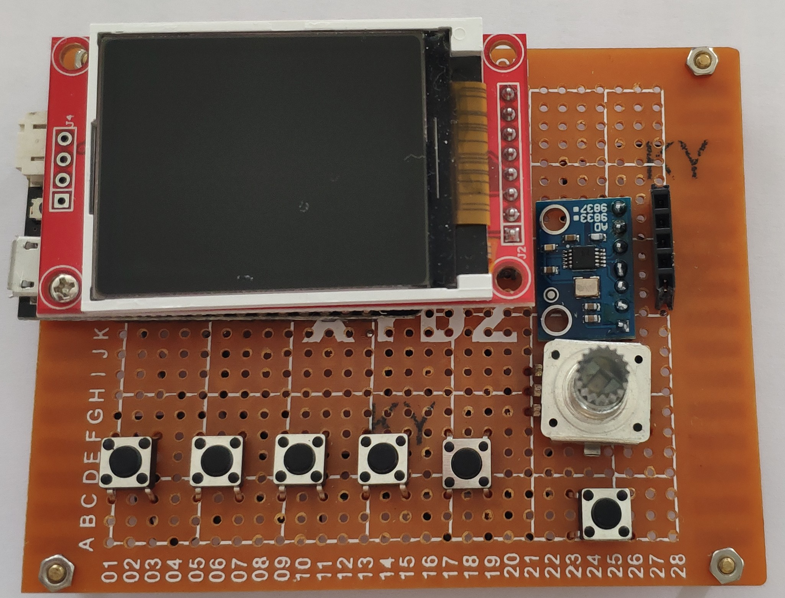
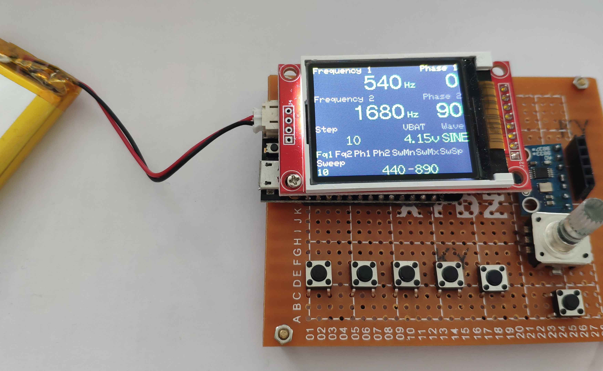

# ESP32 AD9833 Waveform Generator With TFT Screen


## Parts

The following parts were used
- ESP32 (LOLIN32 LITE, but can be easily replaced)
- AD9833 module
- TFT LCD screen 128x160 pixels 1.8 Inch using ST7735
- KY-040 Rotary Encoder
- 6 push buttons
- PNP transistor and 3 resistors

## Schema


Please note that the voltage divider with the 2 resistors from VBAT to GPIO35 is already included in some other boards, like the LOLIND32.

The transister is used to switch the TFT screen backlight on or off.

Overview of ESP32 connections:

| Device | Pin | Device | Pin     |
|--------|----|----------|---------|
| AD9833 |VCC    | ESP32 | 3.3V |
| AD9833 |OGND   | ESP32 | GND |
| AD9833 |SDATA  | ESP32 | GPIO23 (VSPI MOSI) |
| AD9833 |SCLK   | ESP32 | GPIO18 (VSPI SCK) |
| AD9833 |FSYNC  | ESP32 | GPIO5  (VSPI SS) |
| AD9833 |AGND   | output | GND |
| AD9833 |OUT    | output | signal |
| TFT |LED       | ESP32 | GPIO17 (via PNP transistor) |
| TFT |SCK    | ESP32 | GPIO14 (HSPI SCK) |
| TFT |SDA    | ESP32 | GPIO13 (HSPI MOSI) |
| TFT |AO     | ESP32 | GPIO0  (DC) |
| TFT |RESET  | ESP32 | GPIO2  (RST) |
| TFT |CS     | ESP32 | GPIO15  (HSPI CS) |
| TFT |GND    |       ESP32 | GND |
| TFT |VCC    |       ESP32 | 3.3V |
| rotation encoder  | D0/CLK | ESP32 | GPIO33 |
| rotation encoder  | D1/DT  | ESP32 | GPIO32 |
| rotation encoder  | +      |  ESP32 | 3.3V |
| rotation encoder  | GND    |  ESP32 | GND |
| button |STEP  |     ESP32 | GPIO16|
| button |WAVE   |     ESP32 | GPIO12|
| button |SWEEP   |     ESP32 | GPIO27|
| button |FREQ    |     ESP32 | GPIO22|
| button |PHASE   |     ESP32 | GPIO26|
| button |ROTENC  |     ESP32 | GPIO25|
| input | FREQ MODULATION  |     ESP32 | GPIO4 |
| input | PHASE MODULATION  |     ESP32 | GPIO19 |




## Software

Libraries:
- [MD_AD9833 by majicDesigns](https://github.com/MajicDesigns/MD_AD9833)
- [TFT_eSPI by Bodmer](https://github.com/Bodmer/TFT_eSPI)
Note that this library needs customization: in its [User_Setup_Select.h](.pio/libdeps/lolin_d32/TFT_eSPI/User_Setup_Select.h) I enabled `#include <User_Setups/Setup2_ST7735.h>` and in [User_Setup.h](.pio/libdeps/lolin_d32/TFT_eSPI/User_Setup.h) I enabled `#define ST7735_DRIVER` and in the section about 'ESP32 SETUP' I specified my selected settings
    ```
    #define TFT_CS   15 // Chip select control pin
    #define TFT_DC    0  // Data Command control pin
    #define TFT_RST   2  // Reset pin (could connect to RST pin)
    ```
    In [Setup2_ST7735.h](.pio\libdeps\lolin_d32\TFT_eSPI\User_Setups\Setup2_ST7735.h) disable redefinition of these constants:
    ```
    //#define TFT_CS   PIN_D8  // Chip select control pin D8
    //#define TFT_DC   PIN_D3  // Data Command control pin
    //#define TFT_RST  PIN_D4  // Reset pin (could connect to NodeMCU RST, see next line)
    ```
- [Bounce2 by Thomas O Fredericks](https://github.com/thomasfredericks/Bounce2)


All the push buttons cycle though a number of states

| Button | Use |
|-----|---|
|ROTENC | Cycle through the modes of the rotary encoder: Fq1, Fq2, Ph1, Ph2, SwMn, SwMx, SwSp |
|STEP  | Cycle through the step frequencies: 1,10,100,1000,10000,100000 hz |
|WAVE   | Cycle through the wave forms: Sine, Square1, Square2, Triangle |
|SWEEP   | Toggle Sweep on or off |
|FREQ    | Toggle Frequency Channel 1 or 2 |
|PHASE   | Toggle Phase Channel 1 or 2|

Rotary encoder modes:
| Code | Use |
|------|-----|
| Fq1  | Adjust Frequency Channel 1 |
| Fq2  | Adjust Frequency Channel 2 | 
| Ph1  | Adjust Phase Channel 1 |
| Ph1  | Adjust Phase Channel 2 | 
| SwMn | Sweep minimum frequency |
| SwMx | Sweep maximum frequency |
| SwSp | Sweep speed |

Features:
- The settings are persisted in EEPROM of ESP32 after SAVE_SETTINGS_AFTER_MS (=1500) ms
- Backlight is automatically switch off after DIM_BACKLIGHT_AFTER_MS (=10000) ms
- The VBAT display is based on a voltage divider using R2 and R3. Some ESP32 boards will have an built in divider. For instance an LOLIN D32 has a built in VBAT divider connecting to GPIO35. (When the ESP32 is only getting its power from USB, the VBAT display will show a random value)
- The VBAT display in function writeVBAT requires some adjustment. For my resistors I measured that `(float)analogRead(PIN_HALFVBAT)/581` would show the most accurate value.

The main code can be found in [main.cpp](src/main.cpp). The project was created in [PlatformIO for VSCode](https://docs.platformio.org/en/latest/integration/ide/pioide.html#platformio-for-vscode).



